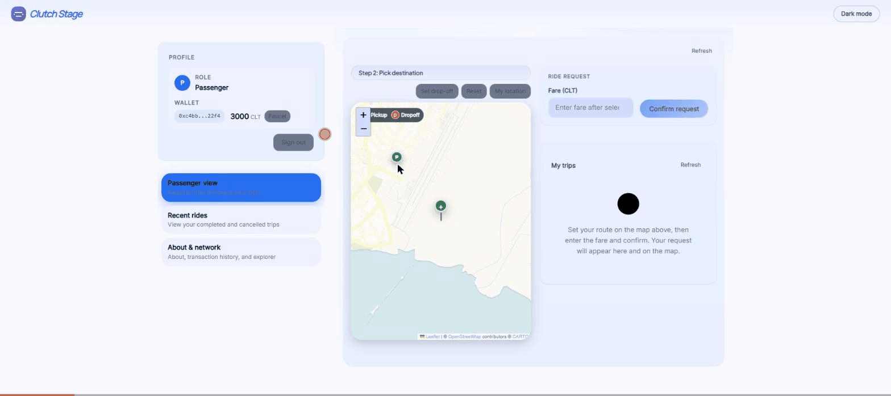

# Hi, I'm Mehran 👋

**Senior full-stack engineer — 8+ years shipping production software.**
Rust · TypeScript · React · Node.js · GraphQL · Docker — currently deep in blockchain infrastructure.

- 🌍 Remote-friendly (UTC+3:30 — full EU overlap) · open to opportunities
- 🌐 [mehranmazhar.com](https://mehranmazhar.com) · ✍️ [dev.to/mehran_mazhar](https://dev.to/mehran_mazhar) · 🐦 [@mehran_mazhar4](https://x.com/mehran_mazhar4)

---

## 🚗 Flagship: Clutch Protocol

An open-source, decentralized ride-sharing network I designed and built from scratch — the whole ride lifecycle (request → offer → accept → pay → cancel) settles as first-class transactions on a **custom non-EVM blockchain written in Rust**. Grew out of [my master's thesis](https://github.com/MehranMazhar/master-thesis).

**[▶ Try the live demo](https://app-stage.clutchprotocol.io)** — in your browser, ~2 min, no install · **[Read how I built it](https://dev.to/mehran_mazhar/how-i-built-a-custom-rust-blockchain-for-on-chain-ride-lifecycle-594i)**

| Repo | What it is | Stack |
|------|------------|-------|
| [clutch-node](https://github.com/clutchprotocol/clutch-node) | Blockchain core: Aura consensus (~1s blocks), libp2p P2P, RocksDB state, WebSocket JSON-RPC | Rust |
| [clutch-hub-api](https://github.com/clutchprotocol/clutch-hub-api) | GraphQL gateway — signed-challenge wallet auth, never holds private keys | Rust · Actix · async-graphql |
| [clutch-hub-sdk-js](https://github.com/clutchprotocol/clutch-hub-sdk-js) | Client SDK on npm — client-side secp256k1 signing, GraphQL subscriptions | TypeScript |
| [clutch-explorer](https://github.com/clutchprotocol/clutch-explorer) | Block explorer: indexer + REST API + UI | Rust · Axum · Postgres · React |
| [clutch-hub-demo-app](https://github.com/clutchprotocol/clutch-hub-demo-app) | Reference passenger/driver app with map-based ride flow | React 19 · Vite · Leaflet |

Full stack comes up with one `docker compose` — see [clutch-deploy](https://github.com/clutchprotocol/clutch-deploy) · docs at [docs.clutchprotocol.io](https://docs.clutchprotocol.io)

---

## 🛠 What I work with

`Rust` `TypeScript` `JavaScript` `React` `Node.js` `GraphQL` `PostgreSQL` `Docker` `libp2p` `RocksDB` `Actix` `Axum` `tokio` `CI/CD (GitHub Actions)` `Prometheus/Grafana`

## 📈 GitHub

---

💬 The interesting unsolved problem in Clutch is **decentralized dispute resolution & reputation** — if you've built marketplace or payments infra, I'd love to talk: [Discussions](https://github.com/orgs/clutchprotocol/discussions)
